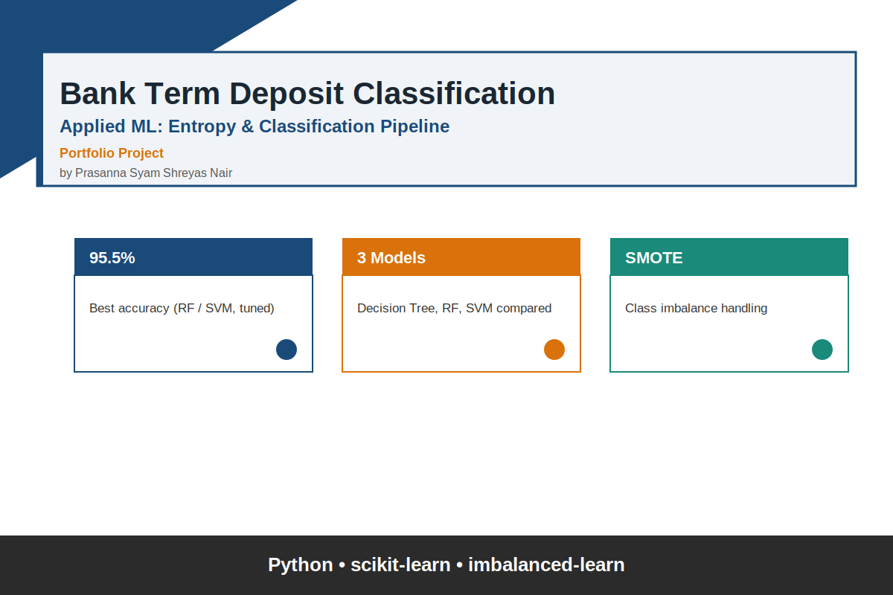
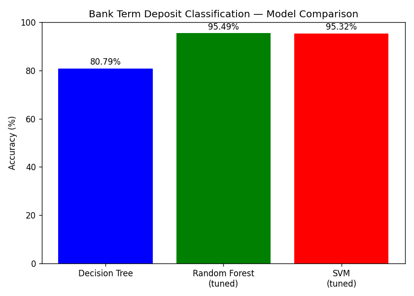

# Applied ML: Entropy & Bank Term Deposit Classification

Two related notebooks on classification fundamentals and a full applied pipeline.

## `entropy_information_gain.ipynb`
A from-scratch implementation of entropy and information gain — the math decision trees use to pick which feature to split on. Good for understanding what's happening under the hood before reaching for `sklearn`.

## `bank_term_deposit_classification.ipynb`
An end-to-end classification pipeline predicting whether a bank client will subscribe to a term deposit:
- Feature encoding and standardization
- **SMOTE** for class imbalance
- **Decision Tree, Random Forest, and SVM** models compared
- **GridSearchCV** for hyperparameter tuning
- Evaluated on accuracy, precision, recall, and F1

`bank.csv` (the UCI Bank Marketing dataset, 4,521 records) is bundled so the notebook runs standalone.

### Results
Random Forest and SVM (both tuned via GridSearchCV) reach ~95.5% accuracy, well above the baseline Decision Tree:

## Tech
Python, pandas, scikit-learn, imbalanced-learn (SMOTE)
